[linkedin](https://www.linkedin.com/in/lakshinpathak-28304a226) &nbsp;·&nbsp;
[leetcode](https://leetcode.com/Lbp2563) &nbsp;·&nbsp;
[email](mailto:lakshin2563@gmail.com)

> Solution Engineer building agentic AI systems — LangChain, LangGraph, MCP 
> servers — at Tatvic Digital Analytics. B.Tech CSE, Nirma University.

I build production agentic systems: multi-agent workflows, tool-calling LLMs, 
and the infra that runs them. Independently scoped and shipped Tatvic's first 
client-facing Agentic AI engagement end-to-end, earning a company Spot Award. 
Also active in research — 18+ IEEE publications and talks at IEEE ICC 2026 
(Glasgow) and IEEE INFOCOM 2025 (London).

<samp>python &nbsp; javascript &nbsp; typescript &nbsp; java &nbsp; c++ &nbsp; sql &nbsp; fastapi &nbsp; django &nbsp; node.js &nbsp; react &nbsp; langchain &nbsp; langgraph &nbsp; tensorflow &nbsp; postgresql &nbsp; mongodb &nbsp; gcp &nbsp; docker</samp>

**[geekbid](https://github.com/LakshinPathak/Geekbid)** &nbsp;·&nbsp; <samp>full-stack, ai job matching</samp> 
Reverse-auction freelance marketplace: price-decay bidding engine, 
AI-assisted job matching, full design system — solo product, eng, and design.

**[picpostchat](https://github.com/LakshinPathak/PicPostChat--Social-Media-Web-Application)** &nbsp;·&nbsp; <samp>node.js, express, mongodb</samp> 
Full-stack social app with real-time chat, post sharing, and auth — live 
in production.

**crop disease detection** &nbsp;·&nbsp; <samp>python, flask, tensorflow</samp> 
Transfer-learning pipeline (EfficientNet) for crop disease classification, 
served through a Flask web app.

Every graphic here is generated, not embedded from anyone else's server — no 
`github-readme-stats.vercel.app`, no streak-card service that can rate-limit 
or go dark. The stat graphics and these section headings are drawn by 
[a scheduled action](.github/workflows/stats.yml) straight from the GitHub 
GraphQL API, once a day, committing only what changed.

They animate with SMIL inside the SVG, because GitHub strips `<script>` from 
READMEs — and since nothing loads from a third party, nothing here can 
rate-limit or go dark. The headings are SVGs for the same reason: GitHub also 
strips CSS, so an image is the only way to put this page's own typeface on them.

The typeface is [JetBrains Mono](scripts/fonts), subset to just the characters 
each graphic draws and inlined as base64.

Language totals cover public repositories only. `year.svg` uses one character 
ramp — `:` `+` `#` `@` — quiet to loud.

<!--
A self-typing ASCII portrait (ascii.svg) can sit at the top of this page, the
same way it does in the original template this repo is built from. It needs a
real, well-lit photo: side light at roughly 45°, everything else off; a tight
crop from chin to just above the hair; 1200px+ resolution. Flat frontal light
and low-res crops both fail — see scripts/make_portrait.py's docstring.

    pip install pillow numpy opencv-python-headless rembg onnxruntime
    python3 scripts/make_portrait.py photo.png --crop LEFT,TOP,RIGHT,BOTTOM
    python3 scripts/embed_portrait_font.py

Then add, near the very top of this file:
    
-->
